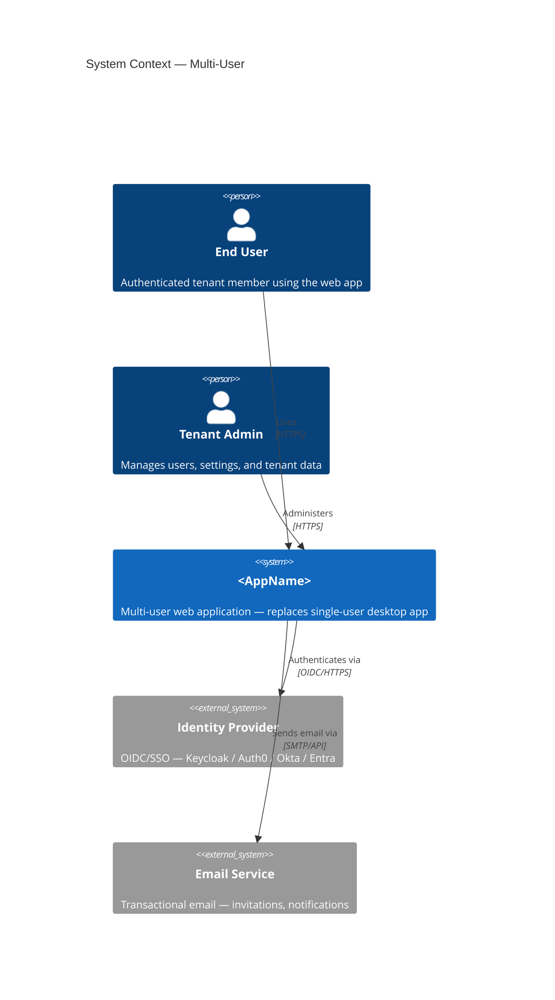
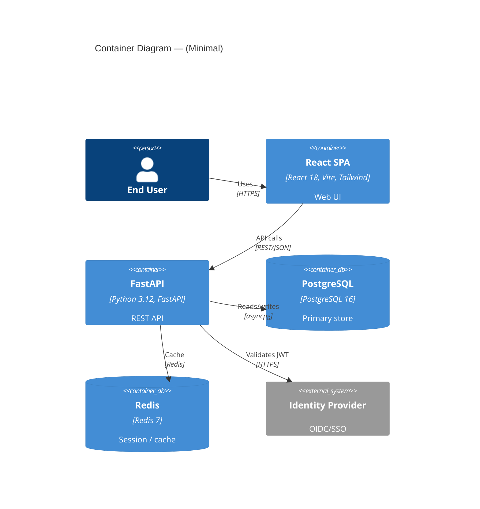
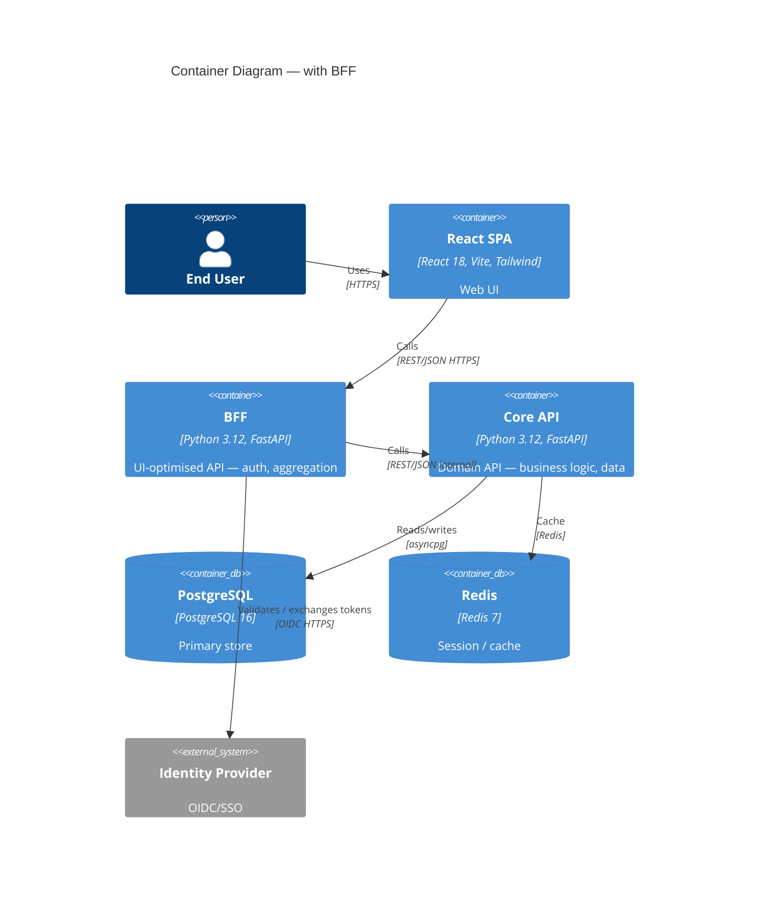

# C4 Diagram Patterns (Mermaid)

Use these templates for the architecture diagrams in the output bundle.
Mermaid C4 uses `C4Context`, `C4Container`, `C4Component` diagram types.

Only include containers/components that are actually needed for this app.
Don't add Redis if there's no session state or caching requirement.
Don't add RabbitMQ if all operations are synchronous.

---

## Context Diagram Template



---

## Container Diagram Template

```mermaid
C4Container
  title Container Diagram — <AppName> Multi-User

  Person(user, "End User")

  Container_Boundary(frontend, "Frontend") {
    Container(spa, "React SPA", "React 18, Vite, Tailwind, shadcn/ui", "Browser-based UI")
  }

  Container_Boundary(backend, "Backend") {
    Container(api, "FastAPI", "Python 3.12, FastAPI, SQLAlchemy, authlib", "REST API — auth, business logic, data access")
    Container(worker, "Async Worker", "Python 3.12, aio-pika", "Processes background jobs from RabbitMQ")
  }

  Container_Boundary(data, "Data") {
    ContainerDb(db, "PostgreSQL", "PostgreSQL 16", "Primary data store — tenant data, user data")
    ContainerDb(redis, "Redis", "Redis 7", "Session state, caching, pub/sub")
    ContainerDb(mq, "RabbitMQ", "RabbitMQ 3", "Work queue — long-running job dispatch")
  }

  System_Ext(idp, "Identity Provider", "OIDC/SSO")
  System_Ext(storage, "Object Storage", "GCS / S3 — file attachments")  %% remove if not needed

  Rel(user, spa, "Uses", "HTTPS")
  Rel(spa, api, "API calls", "REST/JSON HTTPS")
  Rel(api, idp, "Validates JWT via", "OIDC discovery HTTPS")
  Rel(api, db, "Reads/writes", "asyncpg")
  Rel(api, redis, "Caches / pub-sub", "Redis protocol")
  Rel(api, mq, "Dispatches jobs", "AMQP")
  Rel(worker, mq, "Consumes jobs", "AMQP")
  Rel(worker, db, "Reads/writes", "asyncpg")
  Rel(worker, redis, "Publishes progress", "Redis pub/sub")
  Rel(api, storage, "Pre-signed URLs", "HTTPS")  %% remove if not needed
```

---

## Minimal Container Diagram (no worker, no file storage)



---

## BFF Variant (only if ADR mandates BFF)



---

## Notes on C4 in Mermaid

- `Person` — human users
- `System_Ext` — external systems outside your control
- `Container` — deployable unit (process, service, SPA, DB)
- `ContainerDb` — database / data store container (rendered differently)
- `Container_Boundary` — groups containers logically (optional, cosmetic)
- `Rel(from, to, "label", "technology")` — directed relationship

Keep diagrams honest: only include what is actually in the architecture.
A diagram with 5 real containers is better than one with 10 aspirational ones.
