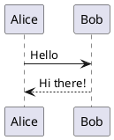
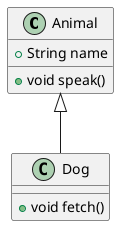
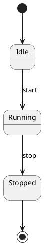
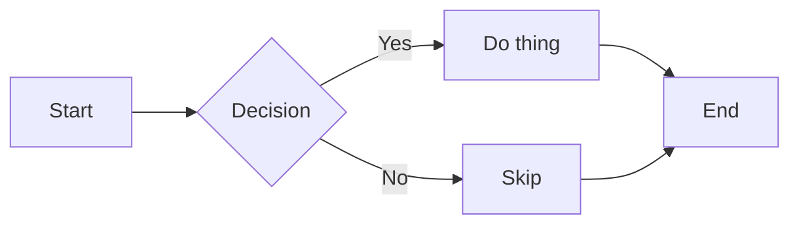
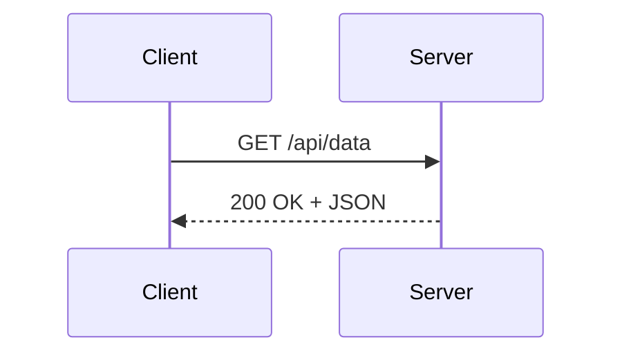
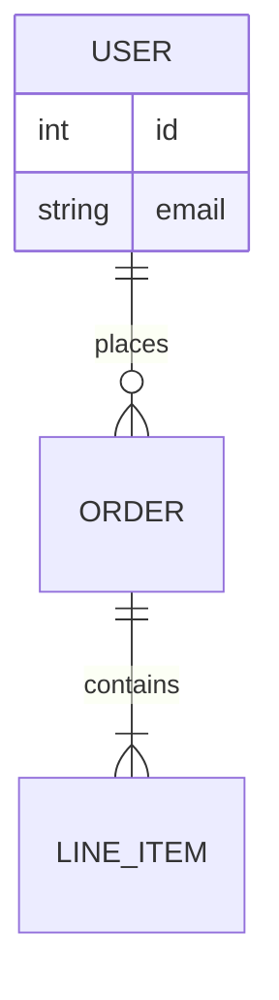
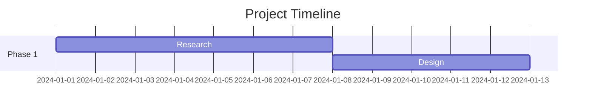
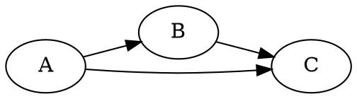
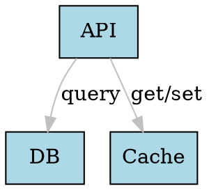

# Diagram Syntax Quick-Start Examples

Minimal working examples for each major diagram type. Extend as needed.

---

## PlantUML (`plantuml`)



C4 context via PlantUML:
```plantuml
@startuml
!include https://raw.githubusercontent.com/plantuml-stdlib/C4-PlantUML/master/C4_Context.puml

Person(user, "User")
System(system, "My System", "Does things")
Rel(user, system, "Uses")
@enduml
```

Class diagram:


State machine:


---

## Mermaid (`mermaid`)

Flowchart:


Sequence:


ERD:


Gantt:


---

## GraphViz / DOT (`graphviz`)

Directed graph:


With styling:


---

## D2 (`d2`)

```d2
users -> api: HTTP
api -> db: SQL
api -> cache: Redis

db: {
  shape: cylinder
}
```

With groups:
```d2
backend: {
  api
  worker
}
backend.api -> backend.worker: queue msg
```

---

## Structurizr DSL (`structurizr`)

```structurizr
workspace {
  model {
    user = person "User"
    system = softwareSystem "My System"
    user -> system "Uses"
  }
  views {
    systemContext system {
      include *
      autoLayout
    }
  }
}
```

---

## C4-PlantUML (`c4plantuml`)

```plantuml
@startuml
!include C4_Container.puml

Person(user, "User", "A person")
System_Boundary(sys, "My System") {
  Container(api, "API", "FastAPI", "Handles requests")
  ContainerDb(db, "Database", "PostgreSQL", "Stores data")
}
Rel(user, api, "Calls", "HTTPS")
Rel(api, db, "Reads/writes", "SQL")
@enduml
```

---

## DBML (`dbml`)

Database markup language — useful for documenting schemas alongside SQLAlchemy
models or Alembic migrations.

```dbml
Table users {
  id integer [primary key]
  email varchar [unique, not null]
  created_at timestamp
}

Table orders {
  id integer [primary key]
  user_id integer [ref: > users.id]
  total numeric
  placed_at timestamp
}
```

SVG only — no PNG output.

---

## ERD (`erd`)

```erd
[User]
*id
+email
created_at

[Order]
*id
+user_id
total

User 1--* Order
```

---

## TikZ (`tikz`)

LaTeX-style typesetting; pricey to render but unmatched for mathematical
figures, circuits, and trees.

```tikz
\documentclass{standalone}
\usepackage{tikz}
\begin{document}
\begin{tikzpicture}
  \node[circle, draw] (A) at (0,0) {A};
  \node[circle, draw] (B) at (2,1) {B};
  \node[circle, draw] (C) at (2,-1) {C};
  \draw[->] (A) -- (B);
  \draw[->] (A) -- (C);
\end{tikzpicture}
\end{document}
```

Note: Kroki runs TikZ in a secure mode by default that blocks
`\verbatiminput` and a few related commands.

---

## Ditaa (`ditaa`)

```ditaa
+--------+   +-------+   +---------+
|        |   |       |   |         |
| Client +-->| Proxy +-->| Backend |
|        |   |       |   |         |
+--------+   +-------+   +---------+
```

---

## Svgbob (`svgbob`)

```svgbob
  +------+     +------+
  | Node |---->| Node |
  +------+     +------+
      |
      v
  +------+
  | Leaf |
  +------+
```

---

## Excalidraw (`excalidraw`)

Source is a JSON blob matching Excalidraw's file format. Export from the
Excalidraw app, then POST the JSON file to Kroki. Not practical to hand-author.

---

## BlockDiag (`blockdiag`)

```blockdiag
blockdiag {
  A -> B -> C -> D;
  A -> E -> F -> G;
}
```

---

## NwDiag (`nwdiag`)

```nwdiag
nwdiag {
  internet [shape = cloud];
  internet -- web01;
  network dmz {
    web01;
  }
  network internal {
    web01;
    db01;
  }
}
```

---

## RackDiag (`rackdiag`)

```rackdiag
rackdiag {
  16U;
  1: UPS
  2: Server01
  3: Server02
  4: Switch
}
```

---

## WaveDrom (`wavedrom`)

```json
{ "signal": [
  { "name": "clk",  "wave": "p......." },
  { "name": "data", "wave": "x.3.x.4.", "data": ["A", "B"] },
  { "name": "ack",  "wave": "0...1...0" }
]}
```

---

## Vega-Lite (`vegalite`)

```json
{
  "$schema": "https://vega.github.io/schema/vega-lite/v5.json",
  "data": { "values": [{"x": 1, "y": 3}, {"x": 2, "y": 5}, {"x": 3, "y": 2}] },
  "mark": "bar",
  "encoding": {
    "x": {"field": "x", "type": "ordinal"},
    "y": {"field": "y", "type": "quantitative"}
  }
}
```

---

## Pikchr (`pikchr`)

```pikchr
arrow right 200% "Hello" above
box "World" fit
arrow right 200%
```

---

## BPMN (`bpmn`)

Source is BPMN 2.0 XML. Best generated by a BPMN tool and POSTed to Kroki.
